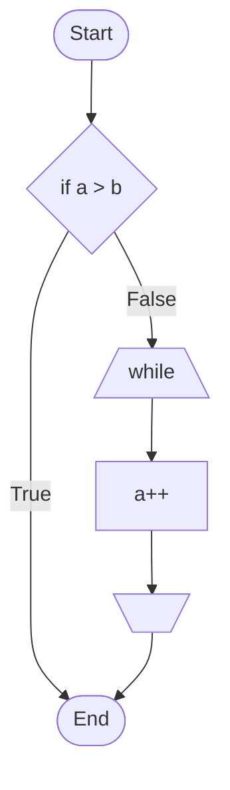

# Try-and-Understand-How-Linux-Works

## chap1 Linuxの概要

## chap2 プロセス管理（基礎編）

## chap3 プロセススケジューラ

## chap4 メモリ管理システム

## chap5 プロセス管理（応用編）

## chap6 デバイスアクセス

## chap7 ファイルシステム

## chap8 記憶階層

## chap9 ブロック層

## chap10 仮想化機能

## chap11 コンテナ

## chap12 cgroup

